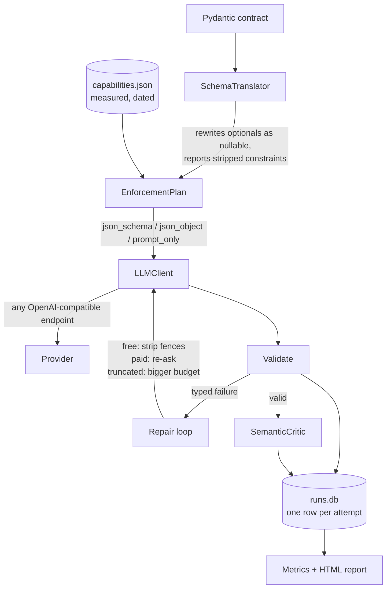

# so-agent

**Structured output is solved. This measures what it costs you.**

Getting an LLM to return valid JSON was a 2023 problem, and native constrained
decoding solved it. So this is not another retry loop. It measures the three
things that broke instead:

- **Does enforcement cost reasoning quality?** Semantic accuracy at each
  enforcement tier, not just parse rate. Nearly everyone assumes enforcement is
  free; nobody publishes the per-model measurement.
- **Is structurally valid output actually correct?** A green schema check now
  hides a wrong answer that would previously have crashed.
- **What does per-call reliability mean once you chain it?** 99% per call is
  roughly 60% success across a 50-step agent trajectory.

The headline artifact is a measured matrix: parse-failure rate and semantic
accuracy by provider, model, enforcement tier, and schema complexity — from real
API calls, against a live provider, on a stated date.

## What the benchmark found

Groq, 18–19 August 2026. 833 extractions across four models, three enforcement
tiers, and three schema difficulties. Every rate below carries its
sample size; the raw run is committed as `bench_results_groq.json`.

**Enforcement tier barely moves structural success. Model capacity decides it.**

| model | tier | n | valid first try | after repair | semantically accurate |
|---|---|---|---|---|---|
| `allam-2-7b` | json_object | 90 | 31.1% | 45.6% | 36.6% |
| `allam-2-7b` | prompt_only | 90 | 37.8% | 45.6% | 46.3% |
| `qwen3.6-27b` | json_schema | 62 | 87.1% | 91.9% | 91.2% |
| `qwen3.6-27b` | prompt_only | 67 | 95.5% | 100.0% | 83.6% |
| `gpt-oss-20b` | json_schema | 90 | 100.0% | 100.0% | 68.9% |
| `gpt-oss-20b` | prompt_only | 90 | 100.0% | 100.0% | 75.6% |
| `gpt-oss-120b` | json_schema | 89 | 100.0% | 100.0% | 85.4% |
| `gpt-oss-120b` | prompt_only | 90 | 100.0% | 100.0% | 73.3% |

Read the pairs. On two of the four models, **asking politely in the prompt beat
native schema enforcement** — `qwen3.6-27b` scored 95.5% with no directive and
87.1% with strict decoding. On the two `gpt-oss` models every tier is 100% and
the ladder buys nothing at all. Comparing tiers *across* models would show
`prompt_only` winning overall, and that comparison is worthless: `allam-2-7b`
cannot run `json_schema`, so the pools contain different models. Only the
within-model pairs above mean anything.

**What actually predicts failure is schema complexity, not the tier:**

| model | simple | nested | hard |
|---|---|---|---|
| `allam-2-7b` | 86.7% | 16.7% | **0.0%** |
| `qwen3.6-27b` | 100.0% | 85.1% | 92.3% |
| `gpt-oss-20b` | 100.0% | 98.9% | 100.0% |
| `gpt-oss-120b` | 100.0% | 100.0% | 100.0% |

A 7B model answers a three-field flat schema 87% of the time and a nested one
with a list of objects **zero percent** of the time — sixty attempts, not one
success on the first try, and the repair loop rescued 3%. That is not a JSON
problem. Of 130 first-attempt failures across the whole run, **119 were
`schema_mismatch`** — valid JSON with the wrong shape — and only **2 were
`not_json`**. Syntax is solved. Structure is not.

**Valid is not correct.** `gpt-oss-20b` is 100% structurally valid at every tier
and semantically accurate 68.9% of the time. Nothing in a schema check catches
the other 31%.

**A chain compounds it.** Pooled across all four models, final success is 87.6%
(85.4–89.9%, n=833). Assuming independence — a ceiling, since real failures
correlate — that is 51.7% over five calls and 26.7% over ten.

### The same model on a second provider

`openai/gpt-oss-20b` is served by both Groq and OpenRouter, so running it on both
holds the weights constant and varies only the serving stack. 45 requests, inside
OpenRouter's daily allowance:

| tier | schema | n | valid first try | accurate |
|---|---|---|---|---|
| json_schema | simple | 5 | 100% | 80% |
| json_schema | nested | 5 | 100% | 80% |
| json_schema | hard | 5 | 80% | 75% |
| json_object | hard | 5 | 100% | 80% |
| prompt_only | simple | 5 | 80% | 80% |

Materially the same behaviour as on Groq at these sample sizes. The one visible
difference — 80% on the hard schema under strict decoding, where Groq was 100% —
rests on five samples and is not something to conclude from.

## The measured capability matrix

Groq, 18 August 2026. Every cell is a real API call, not a documentation claim.
The dated probe record is committed as `capabilities.json`.

| model | json_schema | json_object | tools | prompt_only |
|---|---|---|---|---|
| `openai/gpt-oss-120b` | yes | yes | yes | yes |
| `openai/gpt-oss-20b` | yes | yes | yes | yes |
| `qwen/qwen3.6-27b` | yes | yes | **ignored** | reasons first |
| `allam-2-7b` | no | yes | no | yes |
| `groq/compound-mini` | no | yes | no | yes |
| `groq/compound` | no | yes | no | — |

**Three of six models enforce a native JSON schema.** The rest reject the
directive outright, which is why the enforcement ladder exists rather than being
a formality — on half of this provider's line-up there is nothing to fall back
from.

### Two of the models measured on 14 August no longer existed on 18 August

`llama-3.1-8b-instant` and `llama-3.3-70b-versatile` were both benchmarked, and
both returned 404 four days later. Groq had dropped them. That is the sharpest
statement this repository can make about the shelf life of any number in it, so
the probe records `retired_at` rather than deleting the measurement, the
benchmark ladder is built from the probe instead of a hardcoded list, and
`so-agent providers` warns when your configured model has been withdrawn.

### `groq/compound-mini` is a router, not a model

It was measured, and then excluded: its rate-limit errors name
`llama-3.3-70b-versatile` and `openai/gpt-oss-120b`. Benchmarking it spent two
other models' daily token budgets, and its rates belong to whatever it routed to
on the day rather than to anything nameable.

### `qwen/qwen3.6-27b` gave opposite answers on tools, three days apart

Probed on 15 August, it failed the tool probe on the first sample and passed on
the re-sample, so it was recorded as conforming. Probed again on 18 August, it
failed both — recorded as **IGNORED**: it accepts a tool definition and emits no
tool call.

Same model, same provider, same probe, opposite verdicts. The honest reading is
not either verdict but the variance between them: tool-calling on this model is
unreliable in a way a single measurement of any kind will misrepresent. This is
why non-conforming verdicts are re-sampled before being recorded, and why the
probe stores a date next to every row.

Its `prompt_only` row is a different thing again: asked for JSON with no
enforcement directive, it emits its reasoning first. Nothing was ignored there,
because nothing was sent — which is why the prompt-only baseline is excluded
from the "accepted and ignored" count rather than inflating it.

### What strict mode will not accept

Probed against every model that enforces natively, and identical on all three:

| schema feature | result |
|---|---|
| nested objects, arrays of objects, enums, `$ref`/`$defs` | accepted |
| `anyOf` unions **and** `oneOf` discriminated unions | accepted |
| nullable field (`"type": ["string", "null"]`, still in `required`) | accepted |
| **optional field omitted from `required`** | **rejected everywhere** |
| maximum nesting depth | 6 |

`anyOf` and `oneOf` are probed separately on purpose. Pydantic emits **`oneOf`**
for a discriminated union — not `anyOf` — and they are different keywords a
validator may treat differently. Measuring only `anyOf` and assuming unions work
would have left the shape this library actually sends unmeasured.

That last rejection is the one that matters for anything built on Pydantic.
Pydantic's natural output for an optional field leaves it out of `required`, and
strict mode refuses it: *"`required` is required"*. Optionality has to be
rewritten as a nullable type with the field still required — which is a
translation step, not a configuration flag.

### The same model on two serving stacks

`openai/gpt-oss-20b` is served by both Groq and OpenRouter, so running the probe
against both holds the weights constant and varies only the infrastructure.

**Enforcement behaviour is identical.** All four tiers conform on both, and both
accept schemas to a nesting depth of 6. Whatever constrained decoding these
providers do, they do it the same way for this model.

**Schema acceptance is not identical:**

| schema feature | Groq | OpenRouter |
|---|---|---|
| optional field omitted from `required` | **rejected (400)** | accepted |
| everything else probed | accepted | accepted |

So a schema that works on one provider returns a 400 on the other, for the same
model. The difference is in the serving stack's schema validator rather than in
the model, and it is exactly the kind of thing that turns a provider switch into
an afternoon of debugging. The translation layer has to target the stricter of
the two, not whichever one happened to be developed against.

## Providers

Any OpenAI-compatible endpoint. A provider is a row in `provider/registry.py`,
never a code path — Groq, OpenRouter, OpenAI, Together, Cerebras, and local
Ollama or vLLM servers all work through the same client.

**Groq is the default**, because it is the best place to see the problem: open
models where enforcement support genuinely varies, and a free tier that covers a
benchmark of this size. **OpenRouter** is used for one slice, comparing the same
model across different serving stacks so any difference is attributable to
infrastructure rather than weights.

Neither requires a payment method. That is deliberate: the benchmark should be
reproducible by a reader who cannot or will not add a card.

## The enforcement ladder

Three tiers, in descending order of what they actually guarantee:

| tier | what the provider guarantees | when it applies |
|---|---|---|
| `json_schema` | the shape is enforced during generation | the model was probed as conforming |
| `json_object` | valid JSON; **the shape is not enforced** | native enforcement is unavailable |
| `prompt_only` | nothing | neither directive is available |

The middle rung is the one worth understanding. `json_object` guarantees the
response parses, and says nothing about whether it has the fields you asked for.
That gap is where nearly all the failure lives: **119 of the 129 first-attempt
failures were `schema_mismatch`** — valid JSON with the wrong shape — against
just 2 that were not JSON at all.

The measured surprise is that climbing the ladder does not reliably help. Within
a single model, `prompt_only` matched or beat `json_schema` on two of the four
tested. What the ladder is actually for is narrower and still worth having: on a
model where native enforcement exists it removes a class of failure entirely, and
on the half of this provider's line-up that rejects the directive, there is
nothing to fall back from — you need the rungs below.

Selection is automatic from the probe, and always overridable. Forcing a tier a
model does not support is allowed on purpose: measuring what happens is the point
of the tool.

## Structural success is not correctness

A schema check tells you the output parsed. It cannot tell you the model read the
ticket. Both are measured here, separately:

- **Structural**, deterministic: did it parse and validate against the contract?
- **Semantic**, scored against hand-written labels: is the category one a careful
  reader would accept, and did it invent a customer name the ticket never gave?

The labels allow a *set* of answers wherever a ticket genuinely straddles two
teams, because forcing one answer onto an ambiguous input measures the labeller
rather than the model.

The measured gap is wide. `gpt-oss-20b` produces structurally valid output
**100%** of the time at every tier and is semantically accurate **68.9%** of the
time. A schema check cannot see the difference; that is the entire point.

Grounding is measured separately, and it is where a badly designed contract will
lie to you. An earlier version of `Customer.name` was a required non-nullable
string. Eight of the ten test tickets name nobody, so models had no legal way to
say "not stated" — and the benchmark recorded 80% of extractions as "inventing a
customer name". They were not inventing; the schema left no alternative, and 292
of the flagged values were the literal string the field description had asked
for. With the field nullable and the description asking for `null`, grounding is
**100%** on every model except the 7B one, which still fabricates on nested
schemas (40–55%). Give a model a way to decline and it takes it.

There is also an LLM critic, and it is deliberately not the source of the
headline number. It is scored against the same hand labels first: on
`openai/gpt-oss-20b` it agrees with them on **8 of 8** labelled cases, with zero
false passes and zero false failures. Eight cases is a small set and the number
is quoted with that attached — it is enough to say the critic is not broken, not
enough to put a confidence interval on.

An earlier version agreed only 50% of the time — chance — because it could not
see the allowed enum values and treated inferred judgements like priority as
facts to be found in the text. An unmeasured judge is just a second unvalidated
model, and that version would have published a failure rate of 91.7% for a
system whose real rate was 41.7%.

## Quick start

```bash
pip install -r requirements.txt
cp .env.example .env        # add GROQ_API_KEY
so-agent providers          # makes no API calls
so-agent probe              # measures what your models enforce
python examples/demo.py     # end to end in under a minute
```

`providers` answers "am I set up?" and "how much metered budget is left today?"
without spending any of it. `probe` fills in the model ids: nothing here
hardcodes one, because provider line-ups change often enough that any id written
into this repo would eventually be wrong.

## Using another provider

A provider is a row in `provider/registry.py`, never a code path:

```python
Provider(
    name="openrouter",
    base_url="https://openrouter.ai/api/v1",
    key_env="OPENROUTER_API_KEY",
    daily_budget=45,            # refuses rather than overspending
    is_default_eligible=False,  # never selected implicitly
)
```

Then one argument changes at the call site, and every command takes `--provider`:

```python
agent = StructuredAgent(provider="openrouter", model="openai/gpt-oss-20b:free")
```

```bash
so-agent extract --provider openrouter --schema ticket_triage --text "..."
```

A metered provider must be named explicitly. Reaching one by accident is how a
daily allowance disappears before the work that needed it, and when the budget
runs out the client refuses rather than rerouting — a benchmark row attributed to
the wrong provider is worse than a missing row.

## Library usage

```python
from agent import StructuredAgent
from contracts.schemas import TicketTriage

agent = StructuredAgent(provider="groq", model="openai/gpt-oss-120b")

result = agent.extract(ticket_text, TicketTriage)
if result.ok:
    print(result.value.priority, result.value.assignee)
else:
    print(result.summary())      # says what failed and why, never returns None
```

`result` carries the accounting as well as the value: which tier ran, whether it
was downgraded, every attempt with its failure type, tokens, and latency.

```python
# Let the model pick a response shape instead of filling a fixed one.
result = agent.choose(text, ActionEnvelope)

# Ask for a tool call and validate its arguments — they are model output too.
call, result = agent.call_tool(text, tools=[schema], expected={"refund": Refund})
```

Nothing returns `None` or an empty dict on failure. Silent degradation pushes the
problem downstream to whoever cannot attribute it.

## CLI reference

| command | what it does |
|---|---|
| `so-agent providers` | keys, probe age, and budget left today — no API calls |
| `so-agent probe [--provider] [--refresh]` | measure what each model enforces |
| `so-agent extract --schema NAME --text ...` | one extraction, printed as JSON |
| `so-agent bench --model M [--k N]` | run the matrix, checkpointing each cell |
| `so-agent metrics [--provider] [--tier]` | the tables, computed from the log |
| `so-agent report [--results FILE]` | build the self-contained HTML report |
| `so-agent replay RUN_ID [--provider] [--tier]` | re-run a logged attempt elsewhere |

`--provider` is accepted everywhere and defaults to Groq. Failures exit non-zero.

`replay` is the one that earns the logging. "This extraction failed in
production; would native enforcement have caught it?" is answerable directly
against the same input, because the source text and the raw output that failed
are both in the log.

## Architecture



## Honest evaluation

**These numbers are provider-, model-, and date-specific.** They were measured
against line-ups that change; a model id here may not exist in six months, and a
provider can add or drop enforcement support without announcing it. The date and
provider are printed on every table for that reason.

**The task set is fixed and synthetic.** Ten hand-written support tickets, chosen
to vary in the ways the contracts care about. They are not a sample of anyone's
production traffic, and a different task set would produce different rates.

**Repeats are samples, not reproductions.** Temperature is not pinned to zero and
the runs are not claimed to be deterministic: providers differ in which sampling
settings they honour, and batching alone makes identical output unlikely. Every
rate is reported with its interval and its n.

**Semantic accuracy has two measures and they disagree.** The headline figure is
scored against hand labels. The LLM critic runs alongside as a second opinion,
with its own agreement rate published above rather than assumed. Where they
diverge, that divergence is reported rather than resolved in favour of whichever
looks better.

**The critic did not run inside the matrix.** It shares a token-per-minute
allowance with the models under test, so enabling it made every process queue
behind one small model — measured at roughly two and a half minutes of waiting
around a generation that took under a second. It is validated on its own slice
instead, and the matrix's semantic figures come entirely from the hand labels.
The critic model is also a rung on the ladder, so its verdicts on itself would
not be independent even when it does run.

What transfers is not the percentages. It is the method — probe rather than trust
documentation, re-sample before recording a negative verdict, score correctness
separately from validity, and report the interval — along with the ladder and the
measuring instrument itself.

## Licence

MIT
