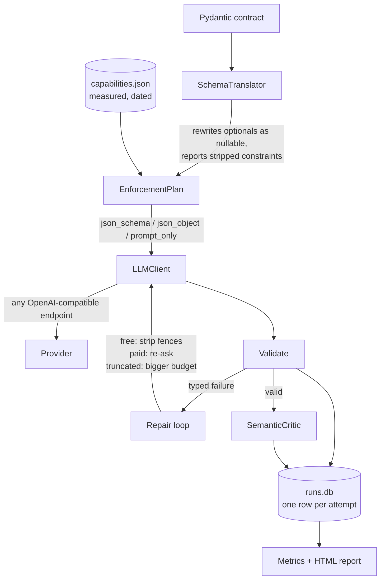

# so-agent

**Structured output is solved. This measures what it costs you.**

Getting an LLM to return valid JSON was a 2023 problem, and native constrained
decoding solved it. So this is not another retry loop. It measures the three
things that broke instead:

- **Does enforcement cost reasoning quality?** Semantic accuracy at each
  enforcement tier, not just parse rate. Nearly everyone assumes enforcement is
  free; nobody publishes the per-model measurement.
- **Is structurally valid output actually correct?** A green schema check now
  hides a wrong answer that would previously have crashed.
- **What does per-call reliability mean once you chain it?** 99% per call is
  roughly 60% success across a 50-step agent trajectory.

The headline artifact is a measured matrix: parse-failure rate and semantic
accuracy by provider, model, enforcement tier, and schema complexity — from real
API calls, against a live provider, on a stated date.

> **Status: in progress.** The capability matrix below is measured. The
> benchmark numbers are not in yet, and nothing is claimed here before it is
> measured.

## The measured capability matrix

Groq, 14–15 August 2026. Every cell is a real API call, not a documentation
claim. The dated probe record is committed as `capabilities.json`, so these rows
can be checked against the measurement rather than taken on trust.

| model | json_schema | json_object | tools | prompt_only |
|---|---|---|---|---|
| `openai/gpt-oss-120b` | yes | yes | yes | yes |
| `openai/gpt-oss-20b` | yes | yes | yes | yes |
| `qwen/qwen3.6-27b` | yes | yes | yes | reasons first |
| `llama-3.3-70b-versatile` | no | yes | yes | yes |
| `llama-3.1-8b-instant` | no | yes | yes | yes |
| `allam-2-7b` | no | yes | no | yes |
| `groq/compound-mini` | no | yes | no | yes |
| `groq/compound` | no | no | no | — |

**Three of eight models enforce a native JSON schema.** The rest reject the
directive outright, which is why the enforcement ladder exists rather than being
a formality — on most of this provider's line-up there is nothing to fall back
from.

**`qwen/qwen3.6-27b` failed the tool probe on its first sample and passed on the
second.** A single sample would have recorded it as a provider that accepts a
tool definition and emits no tool call — the exact failure this project exists to
detect, and in this case not true. Every non-conforming verdict is therefore
re-sampled before it is recorded, because a one-shot probe measures a draw from
the model rather than the provider's behaviour.

Its `prompt_only` row is a different thing again: asked for JSON with no
enforcement directive, it emits its reasoning first. Nothing was ignored there,
because nothing was sent — which is why the prompt-only baseline is excluded
from the "accepted and ignored" count rather than inflating it.

### What strict mode will not accept

Probed against every model that enforces natively, and identical on all three:

| schema feature | result |
|---|---|
| nested objects, arrays of objects, enums, `$ref`/`$defs` | accepted |
| `anyOf` unions **and** `oneOf` discriminated unions | accepted |
| nullable field (`"type": ["string", "null"]`, still in `required`) | accepted |
| **optional field omitted from `required`** | **rejected everywhere** |
| maximum nesting depth | 6 |

`anyOf` and `oneOf` are probed separately on purpose. Pydantic emits **`oneOf`**
for a discriminated union — not `anyOf` — and they are different keywords a
validator may treat differently. Measuring only `anyOf` and assuming unions work
would have left the shape this library actually sends unmeasured.

That last rejection is the one that matters for anything built on Pydantic.
Pydantic's natural output for an optional field leaves it out of `required`, and
strict mode refuses it: *"`required` is required"*. Optionality has to be
rewritten as a nullable type with the field still required — which is a
translation step, not a configuration flag.

### The same model on two serving stacks

`openai/gpt-oss-20b` is served by both Groq and OpenRouter, so running the probe
against both holds the weights constant and varies only the infrastructure.

**Enforcement behaviour is identical.** All four tiers conform on both, and both
accept schemas to a nesting depth of 6. Whatever constrained decoding these
providers do, they do it the same way for this model.

**Schema acceptance is not identical:**

| schema feature | Groq | OpenRouter |
|---|---|---|
| optional field omitted from `required` | **rejected (400)** | accepted |
| everything else probed | accepted | accepted |

So a schema that works on one provider returns a 400 on the other, for the same
model. The difference is in the serving stack's schema validator rather than in
the model, and it is exactly the kind of thing that turns a provider switch into
an afternoon of debugging. The translation layer has to target the stricter of
the two, not whichever one happened to be developed against.

## Providers

Any OpenAI-compatible endpoint. A provider is a row in `provider/registry.py`,
never a code path — Groq, OpenRouter, OpenAI, Together, Cerebras, and local
Ollama or vLLM servers all work through the same client.

**Groq is the default**, because it is the best place to see the problem: open
models where enforcement support genuinely varies, and a free tier that covers a
benchmark of this size. **OpenRouter** is used for one slice, comparing the same
model across different serving stacks so any difference is attributable to
infrastructure rather than weights.

Neither requires a payment method. That is deliberate: the benchmark should be
reproducible by a reader who cannot or will not add a card.

## The enforcement ladder

Three tiers, in descending order of what they actually guarantee:

| tier | what the provider guarantees | when it applies |
|---|---|---|
| `json_schema` | the shape is enforced during generation | the model was probed as conforming |
| `json_object` | valid JSON; **the shape is not enforced** | native enforcement is unavailable |
| `prompt_only` | nothing | neither directive is available |

The middle rung is the one worth understanding. `json_object` guarantees the
response parses, and says nothing about whether it has the fields you asked for.
That is not a small gap: on `llama-3.1-8b-instant`, a simple three-field schema
validated on the first attempt 70% of the time, and the same model on a nested
schema managed 17% — with valid JSON almost every time in both cases.

Selection is automatic from the probe, and always overridable. Forcing a tier a
model does not support is allowed on purpose: measuring what happens is the point
of the tool.

## Structural success is not correctness

A schema check tells you the output parsed. It cannot tell you the model read the
ticket. Both are measured here, separately:

- **Structural**, deterministic: did it parse and validate against the contract?
- **Semantic**, scored against hand-written labels: is the category one a careful
  reader would accept, and did it invent a customer name the ticket never gave?

The labels allow a *set* of answers wherever a ticket genuinely straddles two
teams, because forcing one answer onto an ambiguous input measures the labeller
rather than the model.

There is also an LLM critic, and it is deliberately not the source of the
headline number. It was measured against the same hand labels first: on its
initial version it agreed with them 50% of the time — chance — because it could
not see the allowed enum values and treated inferred judgements like priority as
if they were facts to be found in the text. Fixed, it reached full agreement on
the label set, and the failure rate it reports dropped from 91.7% to 41.7%. An
unmeasured judge is just a second unvalidated model, and the first version of
this one would have published a number that was wrong by half.

## Quick start

```bash
pip install -r requirements.txt
cp .env.example .env        # add GROQ_API_KEY
so-agent providers          # makes no API calls
so-agent probe              # measures what your models enforce
python examples/demo.py     # end to end in under a minute
```

`providers` answers "am I set up?" and "how much metered budget is left today?"
without spending any of it. `probe` fills in the model ids: nothing here
hardcodes one, because provider line-ups change often enough that any id written
into this repo would eventually be wrong.

## Using another provider

A provider is a row in `provider/registry.py`, never a code path:

```python
Provider(
    name="openrouter",
    base_url="https://openrouter.ai/api/v1",
    key_env="OPENROUTER_API_KEY",
    daily_budget=45,            # refuses rather than overspending
    is_default_eligible=False,  # never selected implicitly
)
```

Then one argument changes at the call site, and every command takes `--provider`:

```python
agent = StructuredAgent(provider="openrouter", model="openai/gpt-oss-20b:free")
```

```bash
so-agent extract --provider openrouter --schema ticket_triage --text "..."
```

A metered provider must be named explicitly. Reaching one by accident is how a
daily allowance disappears before the work that needed it, and when the budget
runs out the client refuses rather than rerouting — a benchmark row attributed to
the wrong provider is worse than a missing row.

## Library usage

```python
from agent import StructuredAgent
from contracts.schemas import TicketTriage

agent = StructuredAgent(provider="groq", model="openai/gpt-oss-120b")

result = agent.extract(ticket_text, TicketTriage)
if result.ok:
    print(result.value.priority, result.value.assignee)
else:
    print(result.summary())      # says what failed and why, never returns None
```

`result` carries the accounting as well as the value: which tier ran, whether it
was downgraded, every attempt with its failure type, tokens, and latency.

```python
# Let the model pick a response shape instead of filling a fixed one.
result = agent.choose(text, ActionEnvelope)

# Ask for a tool call and validate its arguments — they are model output too.
call, result = agent.call_tool(text, tools=[schema], expected={"refund": Refund})
```

Nothing returns `None` or an empty dict on failure. Silent degradation pushes the
problem downstream to whoever cannot attribute it.

## CLI reference

| command | what it does |
|---|---|
| `so-agent providers` | keys, probe age, and budget left today — no API calls |
| `so-agent probe [--provider] [--refresh]` | measure what each model enforces |
| `so-agent extract --schema NAME --text ...` | one extraction, printed as JSON |
| `so-agent bench --model M [--k N]` | run the matrix, checkpointing each cell |
| `so-agent metrics [--provider] [--tier]` | the tables, computed from the log |
| `so-agent report [--results FILE]` | build the self-contained HTML report |
| `so-agent replay RUN_ID [--provider] [--tier]` | re-run a logged attempt elsewhere |

`--provider` is accepted everywhere and defaults to Groq. Failures exit non-zero.

`replay` is the one that earns the logging. "This extraction failed in
production; would native enforcement have caught it?" is answerable directly
against the same input, because the source text and the raw output that failed
are both in the log.

## Architecture



## Honest evaluation

**These numbers are provider-, model-, and date-specific.** They were measured
against line-ups that change; a model id here may not exist in six months, and a
provider can add or drop enforcement support without announcing it. The date and
provider are printed on every table for that reason.

**The task set is fixed and synthetic.** Ten hand-written support tickets, chosen
to vary in the ways the contracts care about. They are not a sample of anyone's
production traffic, and a different task set would produce different rates.

**Repeats are samples, not reproductions.** Temperature is not pinned to zero and
the runs are not claimed to be deterministic: providers differ in which sampling
settings they honour, and batching alone makes identical output unlikely. Every
rate is reported with its interval and its n.

**Semantic accuracy has two measures and they disagree.** The headline figure is
scored against hand labels. The LLM critic runs alongside as a second opinion,
with its own agreement rate published above rather than assumed. Where they
diverge, that divergence is reported rather than resolved in favour of whichever
looks better.

**One cell has the critic reviewing its own output**, because the critic model is
also a rung on the measured ladder. Its label-based scores are unaffected; its
critic column for that model is not independent of it.

What transfers is not the percentages. It is the method — probe rather than trust
documentation, re-sample before recording a negative verdict, score correctness
separately from validity, and report the interval — along with the ladder and the
measuring instrument itself.

## Licence

MIT
